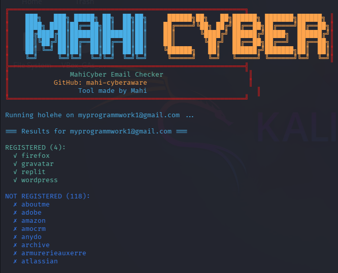

<div align="center">

# MahiCyber Email Checker


**A powerful email lookup tool built by Mahi**  
Check if an email is registered on 120+ websites and find data breaches.



</div>

---

## 📌 Features

- 🔍 **Scans 120+ websites** (social media, forums, e‑commerce, etc.)
- 🚨 **Detects data breaches** (e.g., Adobe, LinkedIn, etc.)
- 🎨 **Beautiful hacker‑style banner** with your branding
- 💾 **Saves results** in JSON format inside `records/` folder
- 🔒 **Secure** – your API key is stored in `.env` (ignored by Git)
- 🐍 **Written in Python** – easy to modify and extend

---

## 🚀 Installation

### 1. Clone the repository

Choose one of the following methods:

**HTTPS**
```bash
git clone https://github.com/mahi-cyberaware/email-checker.git
```
**SSH**

```bash
git clone git@github.com:mahi-cyberaware/email-checker.git
```
**GitHub CLI**

```bash
gh repo clone mahi-cyberaware/email-checker
```
Then enter the project directory:

```bash
cd email-checker
```
**2. Set up a virtual environment (recommended)**
```bash
python3 -m venv venv
source venv/bin/activate   # On Windows: venv\Scripts\activate
```
**3. Install dependencies**
```bash
pip install colorama
```
**Note: This tool uses holehe as the scanning engine. If holehe is not already installed, install it with:**

```bash
sudo apt install holehe          # Kali / Debian / Ubuntu
```
# or
```
pipx install holehe              # Alternative (recommended)
````

##🎯 Usage
Run the script with an email address:

```bash
python checker.py your.email@example.com
```
Example output:

text
REGISTERED (4):
  ✓ firefox
  ✓ gravatar
  ✓ replit
  ✓ wordpress

NOT REGISTERED (118):
  ✗ adobe
  ✗ amazon
  ✗ discord
  ✗ ...
Results are automatically saved in the records/ folder as JSON files with timestamps.

**🤝 Contributing**
Pull requests are welcome! For major changes, please open an issue first to discuss what you'd like to change.

**📝 License**
**MIT**

<div align="center"> Made with ❤️ by <a href="https://github.com/mahi-cyberaware">MahiCyber</a> </div> ```
